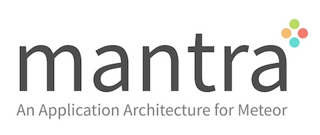

## Overview

Mantra is an application architecture for [Meteor](https://www.meteor.com/). With Mantra, we try to achieve two main goals.

**1. High Maintainability**

Maintainability is a key factor for success when working with a large team. We achieve this by **unit testing** every part of our app, while following **standards** for everything. Then it's easy to on-board new users and work with teams.

**2. Future Proof**

JavaScript is a land of **choices**. We have more than one best thing for each problem. It can be hard to tell what’s the **best solution** now and what will change in the **future**.

*Mantra relies on a set of core principles that will last for a long time. Then, we let others to change as needed.*

[Read Mantra Specification to learn more about Mantra.](https://kadirahq.github.io/mantra/)

## Sample App

We've a demo app which implements most of the features of Mantra Specification. Here it is:

* [Live Version](http://mantra-sample-blog.meteor.com/)
* [Repo](https://github.com/mantrajs/mantra-sample-blog-app)

## Let's Build Mantra Together

This is just the start, let's build Mantra together. Try building sample apps with Mantra. Experiment with it.

Then share your [experience](https://github.com/kadirahq/mantra/issues) and [discuss](https://github.com/kadirahq/mantra/issues) how we can improve Mantra.
